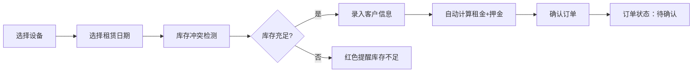
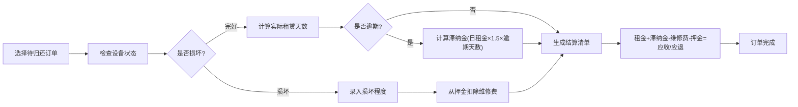

## 1. 产品概述

设备租赁管理系统是一套面向建筑设备、摄影器材、活动设备等租赁场景的全流程管理平台。系统涵盖设备管理、订单处理、库存调度、客户关系、财务结算和数据分析六大核心模块，帮助租赁企业实现数字化运营，提升设备利用率和客户满意度。

- 核心价值：解决租赁行业设备调度混乱、租金计算易错、库存管理低效、客户流失等痛点
- 目标用户：设备租赁公司管理员、运营人员、财务人员

## 2. 核心功能

### 2.1 用户角色

| 角色 | 注册方式 | 核心权限 |
|------|----------|----------|
| 系统管理员 | 内置账号 | 全功能权限，设备/订单/客户/报表全模块管理 |
| 运营人员 | 管理员创建 | 设备管理、订单创建与归还、日历查看 |
| 财务人员 | 管理员创建 | 结算管理、报表查看、客户信用管理 |

### 2.2 功能模块

1. **仪表盘**：数据概览、设备利用率、营收趋势、库存预警
2. **设备管理**：设备CRUD、分类管理、条码管理、库存预警
3. **租赁订单**：订单创建、设备选择、日期范围、自动计算金额
4. **日历视图**：甘特图展示、设备占用情况、冲突检测
5. **归还结算**：设备检查、损坏扣费、逾期滞纳金、结算清单
6. **客户管理**：客户档案、租赁历史、信用记录、VIP等级、黑名单

### 2.3 页面详情

| 页面名称 | 模块名称 | 功能描述 |
|-----------|-------------|---------------------|
| 仪表盘 | 数据概览 | 设备利用率、月营收折线图、分类租赁饼图、逾期率、热门TOP10、库存预警 |
| 设备列表 | 设备管理 | 设备列表展示、搜索筛选、新增/编辑/删除设备、状态管理 |
| 设备表单 | 设备管理 | 录入设备名称、分类、品牌型号、日租金、押金、库存、状态、照片URL、条码编号 |
| 订单列表 | 租赁订单 | 订单列表、状态筛选、查看详情、订单操作 |
| 订单创建 | 租赁订单 | 选择设备+数量、日期范围、租赁人信息、自动计算租金押金、冲突检测 |
| 日历视图 | 调度中心 | 甘特图展示设备占用、横轴日期纵轴设备、色块表示预订、红色冲突提醒 |
| 归还处理 | 归还结算 | 检查设备状态、录入损坏情况、计算维修费、生成结算单 |
| 客户列表 | 客户管理 | 客户档案、租赁历史、信用记录、VIP标识、黑名单标记 |
| 客户详情 | 客户管理 | 客户基本信息、累计消费、信用评分、租赁记录列表 |

## 3. 核心流程

### 3.1 租赁流程

### 3.2 归还结算流程

## 4. 用户界面设计

### 4.1 设计风格
- **主色调**：专业深蓝 `#1e40af`，代表可靠与专业
- **辅助色**：成功绿 `#059669`、警示橙 `#d97706`、危险红 `#dc2626`
- **中性色**：深灰 `#1f2937`、中灰 `#6b7280`、浅灰 `#f3f4f6`
- **按钮风格**：圆角 `8px`，悬停有轻微上浮和阴影变化
- **字体**：标题使用「思源黑体 Bold」，正文使用「思源宋体 Regular」
- **布局风格**：卡片式布局，顶部导航+左侧菜单+主内容区
- **图标风格**：线性图标，统一使用 lucide-react 图标库

### 4.2 页面设计概述

| 页面名称 | 模块名称 | UI 元素 |
|-----------|-------------|-------------|
| 仪表盘 | 数据概览 | 统计卡片网格、折线图、饼图、TOP10排行榜、预警列表 |
| 设备列表 | 设备管理 | 搜索栏、筛选标签、数据表格、操作按钮、分页 |
| 日历视图 | 调度中心 | 日期导航条、设备列表侧边栏、甘特图网格、色块图例 |
| 订单创建 | 租赁订单 | 设备选择器、日期范围选择器、客户信息表单、实时价格计算 |

### 4.3 响应式
- 桌面端（1280px+）：三栏布局，左侧菜单240px，主内容区自适应
- 平板端（768px-1279px）：两栏布局，菜单可折叠
- 移动端（<768px）：单栏布局，底部导航，表格可横向滚动

## 5. 业务规则

### 5.1 金额计算规则
- 租金 = 日租金 × 租赁天数 × 设备数量
- 押金 = 设备押金 × 设备数量
- 滞纳金 = 日租金 × 1.5 × 逾期天数
- 结算金额 = 租金 + 滞纳金 - 维修费 - 押金

### 5.2 客户等级规则
- 普通客户：累计消费 < 10000元，无折扣
- VIP客户：累计消费 ≥ 10000元，享受95折
- SVIP客户：累计消费 ≥ 50000元，享受9折

### 5.3 库存规则
- 库存预警阈值：设备库存 ≤ 2件时显示预警
- 冲突检测：同一日期范围内，已租数量 + 新租数量 > 库存数量时标记为红色
- 设备状态：可租/维修中/已下架，仅"可租"状态设备可被租赁

### 5.4 信用规则
- 逾期1次：扣信用分10分
- 设备损坏1次：扣信用分20分
- 信用分 < 60分：加入黑名单，禁止租赁
