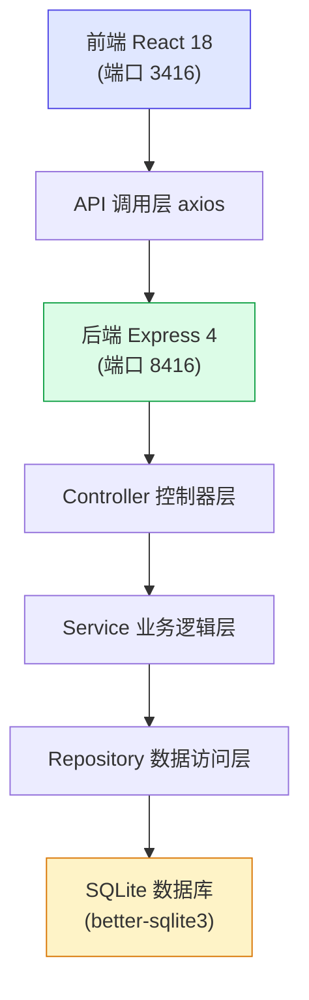
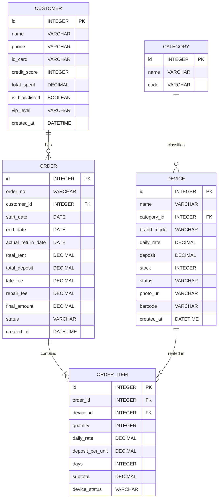
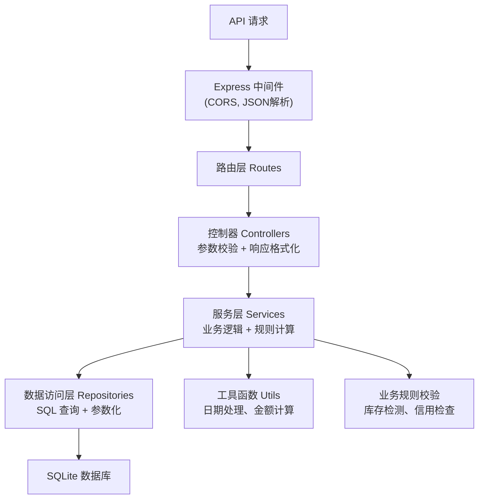

## 1. 架构设计



## 2. 技术栈描述

### 2.1 前端技术栈
- **框架**: React 18 + TypeScript
- **构建工具**: Vite 5
- **样式**: TailwindCSS 3.4
- **状态管理**: Zustand 4
- **路由**: React Router DOM 6
- **图表**: Recharts 2
- **HTTP 客户端**: Axios 1.6
- **图标**: Lucide React
- **UI 组件**: 自定义组件 + Headless UI

### 2.2 后端技术栈
- **框架**: Express 4.18
- **语言**: TypeScript
- **数据库**: SQLite (better-sqlite3)
- **ORM**: 原生 SQL + 参数化查询
- **CORS**: cors 中间件
- **日期处理**: dayjs

### 2.3 端口配置
- 前端开发服务器: `http://localhost:3416`
- 后端 API 服务器: `http://localhost:8416`

## 3. 项目目录结构

```
hwj-00416/
├── .trae/documents/          # 项目文档
├── api/                       # 后端代码
│   ├── src/
│   │   ├── controllers/       # 控制器
│   │   ├── services/          # 业务逻辑
│   │   ├── repositories/      # 数据访问
│   │   ├── routes/            # 路由定义
│   │   ├── db/                # 数据库初始化
│   │   ├── types/             # 类型定义
│   │   ├── utils/             # 工具函数
│   │   └── index.ts           # 入口文件
│   ├── data/                  # 数据库文件
│   └── package.json
├── src/                       # 前端代码
│   ├── components/            # 公共组件
│   ├── pages/                 # 页面组件
│   ├── store/                 # Zustand 状态管理
│   ├── hooks/                 # 自定义 Hooks
│   ├── utils/                 # 工具函数
│   ├── types/                 # 类型定义
│   ├── api/                   # API 调用
│   ├── App.tsx
│   └── main.tsx
├── shared/                    # 共享类型定义
├── package.json
├── tsconfig.json
├── vite.config.ts
└── tailwind.config.js
```

## 4. 路由定义

### 4.1 前端路由

| 路由路径 | 页面名称 | 说明 |
|----------|----------|------|
| `/` | 仪表盘 | 数据概览、统计图表 |
| `/devices` | 设备列表 | 设备管理列表 |
| `/devices/new` | 新增设备 | 设备信息录入 |
| `/devices/:id/edit` | 编辑设备 | 设备信息修改 |
| `/orders` | 订单列表 | 所有租赁订单 |
| `/orders/new` | 创建订单 | 新建租赁单 |
| `/orders/:id` | 订单详情 | 查看订单信息 |
| `/orders/:id/return` | 归还结算 | 设备归还处理 |
| `/calendar` | 日历视图 | 甘特图设备调度 |
| `/customers` | 客户列表 | 客户档案管理 |
| `/customers/:id` | 客户详情 | 客户信息与历史 |

### 4.2 后端 API 路由

| 方法 | 路径 | 说明 |
|------|------|------|
| GET | `/api/devices` | 获取设备列表 |
| GET | `/api/devices/:id` | 获取设备详情 |
| POST | `/api/devices` | 创建设备 |
| PUT | `/api/devices/:id` | 更新设备 |
| DELETE | `/api/devices/:id` | 删除设备 |
| GET | `/api/devices/:id/availability` | 检查设备可用性 |
| GET | `/api/orders` | 获取订单列表 |
| GET | `/api/orders/:id` | 获取订单详情 |
| POST | `/api/orders` | 创建订单 |
| PUT | `/api/orders/:id/status` | 更新订单状态 |
| POST | `/api/orders/:id/return` | 归还设备与结算 |
| GET | `/api/customers` | 获取客户列表 |
| GET | `/api/customers/:id` | 获取客户详情 |
| POST | `/api/customers` | 创建客户 |
| PUT | `/api/customers/:id` | 更新客户 |
| GET | `/api/stats/dashboard` | 获取仪表盘统计数据 |
| GET | `/api/stats/revenue` | 获取营收趋势 |
| GET | `/api/calendar/bookings` | 获取日历预订数据 |

## 5. 数据模型

### 5.1 ER 图



### 5.2 DDL 语句

```sql
-- 分类表
CREATE TABLE categories (
  id INTEGER PRIMARY KEY AUTOINCREMENT,
  name VARCHAR(50) NOT NULL,
  code VARCHAR(20) NOT NULL UNIQUE
);

-- 设备表
CREATE TABLE devices (
  id INTEGER PRIMARY KEY AUTOINCREMENT,
  name VARCHAR(100) NOT NULL,
  category_id INTEGER NOT NULL,
  brand_model VARCHAR(100),
  daily_rate DECIMAL(10,2) NOT NULL DEFAULT 0,
  deposit DECIMAL(10,2) NOT NULL DEFAULT 0,
  stock INTEGER NOT NULL DEFAULT 0,
  status VARCHAR(20) NOT NULL DEFAULT 'available',
  photo_url VARCHAR(255),
  barcode VARCHAR(50) UNIQUE,
  created_at DATETIME DEFAULT CURRENT_TIMESTAMP,
  FOREIGN KEY (category_id) REFERENCES categories(id)
);

-- 客户表
CREATE TABLE customers (
  id INTEGER PRIMARY KEY AUTOINCREMENT,
  name VARCHAR(50) NOT NULL,
  phone VARCHAR(20) NOT NULL UNIQUE,
  id_card VARCHAR(20) UNIQUE,
  credit_score INTEGER NOT NULL DEFAULT 100,
  total_spent DECIMAL(12,2) NOT NULL DEFAULT 0,
  is_blacklisted BOOLEAN NOT NULL DEFAULT 0,
  vip_level VARCHAR(20) NOT NULL DEFAULT 'normal',
  created_at DATETIME DEFAULT CURRENT_TIMESTAMP
);

-- 订单表
CREATE TABLE orders (
  id INTEGER PRIMARY KEY AUTOINCREMENT,
  order_no VARCHAR(30) NOT NULL UNIQUE,
  customer_id INTEGER NOT NULL,
  start_date DATE NOT NULL,
  end_date DATE NOT NULL,
  actual_return_date DATE,
  total_rent DECIMAL(12,2) NOT NULL DEFAULT 0,
  total_deposit DECIMAL(12,2) NOT NULL DEFAULT 0,
  late_fee DECIMAL(12,2) NOT NULL DEFAULT 0,
  repair_fee DECIMAL(12,2) NOT NULL DEFAULT 0,
  final_amount DECIMAL(12,2),
  status VARCHAR(20) NOT NULL DEFAULT 'pending',
  remarks TEXT,
  created_at DATETIME DEFAULT CURRENT_TIMESTAMP,
  FOREIGN KEY (customer_id) REFERENCES customers(id)
);

-- 订单明细表
CREATE TABLE order_items (
  id INTEGER PRIMARY KEY AUTOINCREMENT,
  order_id INTEGER NOT NULL,
  device_id INTEGER NOT NULL,
  quantity INTEGER NOT NULL DEFAULT 1,
  daily_rate DECIMAL(10,2) NOT NULL,
  deposit_per_unit DECIMAL(10,2) NOT NULL,
  days INTEGER NOT NULL,
  subtotal DECIMAL(12,2) NOT NULL,
  device_status VARCHAR(20) DEFAULT 'good',
  repair_note TEXT,
  FOREIGN KEY (order_id) REFERENCES orders(id),
  FOREIGN KEY (device_id) REFERENCES devices(id)
);

-- 索引
CREATE INDEX idx_orders_customer ON orders(customer_id);
CREATE INDEX idx_orders_status ON orders(status);
CREATE INDEX idx_orders_dates ON orders(start_date, end_date);
CREATE INDEX idx_order_items_order ON order_items(order_id);
CREATE INDEX idx_order_items_device ON order_items(device_id);
CREATE INDEX idx_devices_category ON devices(category_id);
CREATE INDEX idx_devices_status ON devices(status);
CREATE INDEX idx_customers_phone ON customers(phone);
```

## 6. 预置数据

### 6.1 分类数据（5条）
- 摄影器材
- 音响设备
- 照明设备
- 舞台设备
- 工具类

### 6.2 设备数据（20条）
覆盖5个分类，包含常见的摄影、音响、照明、舞台设备和工具

### 6.3 订单数据（30条）
- 状态分布：待确认、已出库、使用中、已归还、逾期
- 日期范围：近3个月的数据
- 包含不同客户的租赁记录

### 6.4 客户数据（15条）
- 普通客户
- VIP客户（消费满10000）
- SVIP客户（消费满50000）
- 黑名单客户（信用分<60）

## 7. 服务器架构



## 8. 类型定义（共享）

```typescript
// shared/types.ts
export type DeviceCategory = 'photography' | 'audio' | 'lighting' | 'stage' | 'tools';
export type DeviceStatus = 'available' | 'maintenance' | 'offline';
export type OrderStatus = 'pending' | 'out' | 'in_use' | 'returned' | 'overdue';
export type CustomerLevel = 'normal' | 'vip' | 'svip';
export type DeviceReturnStatus = 'good' | 'damaged' | 'lost';

export interface Device {
  id: number;
  name: string;
  categoryId: number;
  categoryName?: string;
  brandModel: string;
  dailyRate: number;
  deposit: number;
  stock: number;
  status: DeviceStatus;
  photoUrl?: string;
  barcode?: string;
  createdAt: string;
}

export interface Customer {
  id: number;
  name: string;
  phone: string;
  idCard?: string;
  creditScore: number;
  totalSpent: number;
  isBlacklisted: boolean;
  vipLevel: CustomerLevel;
  createdAt: string;
}

export interface OrderItem {
  id: number;
  orderId: number;
  deviceId: number;
  deviceName?: string;
  quantity: number;
  dailyRate: number;
  depositPerUnit: number;
  days: number;
  subtotal: number;
  deviceStatus?: DeviceReturnStatus;
  repairNote?: string;
}

export interface Order {
  id: number;
  orderNo: string;
  customerId: number;
  customerName?: string;
  customerPhone?: string;
  startDate: string;
  endDate: string;
  actualReturnDate?: string;
  totalRent: number;
  totalDeposit: number;
  lateFee: number;
  repairFee: number;
  finalAmount?: number;
  status: OrderStatus;
  remarks?: string;
  items?: OrderItem[];
  createdAt: string;
}
```
